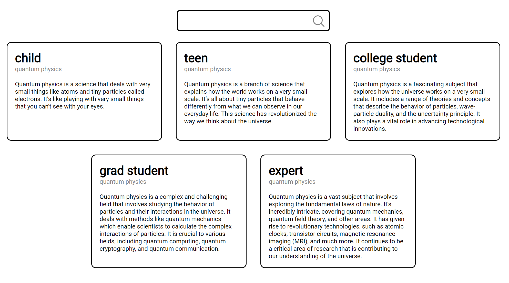

# Explain This



Explain This is a SvelteKit web application that explains topics to a child, teen, college student, grad student, and expert.

It utilizes the ChatGPT API to generate explanations with one API request per search instead of a request for each
group above. The response is streamed to the user as it is generated.

## Developing
Clone the repository locally and install the dependencies:

```bash
git clone https://github.com/tarikjaber/Explain-This.git
npm install
````

To start a local development server:

```bash
npm run dev

# or start the server and open the app in a new browser tab
npm run dev -- --open
```

## Building

To create a production version of Explain This:

```bash
npm run build
```

You can preview the production build with `npm run preview`.

> To deploy your app, you may need to install an [adapter](https://kit.svelte.dev/docs/adapters) for your target environment.
